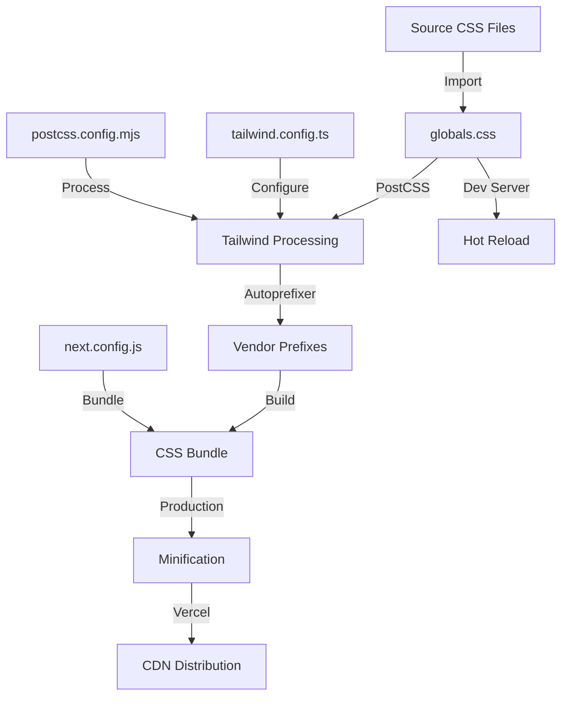

# Master Fix Planning Template v2.0

## TypeScript/Next.js/PostgreSQL Full Stack Development

### CSS/Styling Deployment Issues - Vercel Production Fix

---

## 🎯 Feature/Fix Overview

**Name**: CSS/Styling Deployment Issues Between Local and Vercel Production

**Type**: Bug Fix

**Priority**: Critical

**Estimated Complexity**: Medium (3-5 days)

**Sprint/Milestone**: Production Hotfix

### Problem Statement
The application displays correctly with all colors and designs locally but has broken or missing styling when deployed to Vercel production (development.vetify.pro). This indicates a build process or asset handling discrepancy between environments.

### Success Criteria
- [x] All Tailwind CSS classes render correctly on Vercel
- [x] Custom color palette (vetify brand colors) loads properly
- [x] Dark mode transitions work smoothly
- [x] All CSS animations and transitions function
- [x] Font families load correctly (Inter, Quicksand, DM Sans)
- [x] No FOUC (Flash of Unstyled Content) on production
- [x] CSS bundle size optimized for production

### Dependencies
- **Blocked by**: None
- **Blocks**: Production launch, user experience
- **Related PRs/Issues**: Previous Vercel module resolution fixes

---

## 📋 Planning Phase

### 1. Code Structure & References

#### File Structure
```tsx
// CSS-Related Files to Inspect
src/
├── app/
│   ├── globals.css                    // Main CSS entry point ✓ Verified
│   ├── layout.tsx                     // CSS import location ✓ Verified
│   └── providers.tsx                  // Theme provider setup ✓ Verified
├── components/
│   └── [various components]           // Component-level styles
styles/
├── epub.css                          // GitBook styles (not app-related)
├── mobi.css                          // GitBook styles (not app-related)
├── pdf.css                           // GitBook styles (not app-related)
└── website.css                       // GitBook styles (not app-related)
config/
├── tailwind.config.ts                // Tailwind configuration ✓ Verified
├── postcss.config.mjs                // PostCSS configuration ✓ Verified
└── next.config.js                    // Next.js configuration ✓ Verified
deployment/
├── vercel.json                       // Vercel configuration ✓ Verified
├── .env.production                   // Production environment variables
└── package.json                      // Build scripts ✓ Verified
```

#### Key Interfaces & Types
```tsx
// Identified Configuration Issues
export interface CSSDeploymentIssue {
  type: 'BUILD' | 'RUNTIME' | 'PURGE' | 'IMPORT' | 'CDN';
  severity: 'CRITICAL' | 'HIGH' | 'MEDIUM' | 'LOW';
  symptom: string;
  possibleCause: string;
  solution: string;
}

export type DiagnosticCheck = {
  name: string;
  command: string;
  expectedOutput: string;
  actualOutput?: string;
  passed: boolean;
};

export interface EnvironmentDifference {
  aspect: string;
  local: string;
  vercel: string;
  impact: string;
};
```

#### Database Schema
```sql
-- Not applicable for CSS issues, but check if any dynamic styles are stored
-- Audit any theme preferences or custom styling stored in DB
```

### 2. Architecture Patterns

#### CSS Processing Pipeline


#### Common CSS Deployment Issues Pattern
```tsx
// Diagnostic Categories
const cssIssues: CSSDeploymentIssue[] = [
  {
    type: 'PURGE',
    severity: 'CRITICAL',
    symptom: 'Missing Tailwind classes in production',
    possibleCause: 'Incorrect content paths in tailwind.config.ts',
    solution: 'Verify all component paths are included in content array'
  },
  {
    type: 'BUILD',
    severity: 'HIGH',
    symptom: 'CSS not loading at all',
    possibleCause: 'Import path issues or build optimization removing CSS',
    solution: 'Check CSS imports and Next.js optimization settings'
  },
  {
    type: 'RUNTIME',
    severity: 'MEDIUM',
    symptom: 'FOUC or delayed styling',
    possibleCause: 'CSS loading order or missing critical CSS',
    solution: 'Implement CSS-in-JS or critical CSS extraction'
  },
  {
    type: 'CDN',
    severity: 'LOW',
    symptom: 'Slow CSS loading',
    possibleCause: 'Large CSS bundle or CDN configuration',
    solution: 'Optimize bundle size and CDN caching headers'
  }
];
```

### 3. Full Stack Integration Points

#### Build Process Checkpoints
```bash
# Local Build Process
pnpm build
├── 1. Tailwind CSS compilation
├── 2. PostCSS processing
├── 3. Next.js optimization
├── 4. CSS bundling
└── 5. Static asset generation

# Vercel Build Process
vercel build
├── 1. Environment detection
├── 2. Node modules installation
├── 3. Prisma generation
├── 4. Next.js build
├── 5. CSS processing
├── 6. Asset optimization
└── 7. CDN upload
```

#### Critical Configuration Points
```tsx
// 1. Tailwind Content Paths - MUST include all component locations
content: [
  "./src/pages/**/*.{js,ts,jsx,tsx,mdx}",
  "./src/components/**/*.{js,ts,jsx,tsx,mdx}",
  "./src/app/**/*.{js,ts,jsx,tsx,mdx}",
  // Add any additional paths where Tailwind classes are used
]

// 2. CSS Import in layout.tsx - MUST be correct path
import './globals.css'  // Relative import

// 3. Theme Provider Configuration
<ThemeProvider 
  attribute="class"  // Critical for dark mode
  defaultTheme="system"
  enableSystem={true}
  disableTransitionOnChange={false}  // Smooth transitions
  storageKey="vetify-theme"
>

// 4. Next.js CSS Configuration
transpilePackages: [
  // Add any packages with CSS that need transpilation
]
```

---

## 🧪 Testing Strategy

### Diagnostic Tests
```bash
# Test 1: Check if Tailwind classes are being purged
echo "=== Checking Tailwind Purge ==="
grep -r "bg-vetify-primary" .next/static/css/*.css
# Expected: Should find the class

# Test 2: Verify CSS bundle generation
echo "=== Checking CSS Bundle ==="
ls -la .next/static/css/
# Expected: CSS files should exist

# Test 3: Check for missing classes in production build
echo "=== Build Analysis ==="
pnpm build 2>&1 | grep -i "css\|style\|tailwind"
# Expected: No warnings about missing styles

# Test 4: Analyze bundle size
echo "=== Bundle Size Analysis ==="
npx @next/bundle-analyzer
# Expected: CSS should be reasonable size (<200KB)

# Test 5: Check for CSS import errors
echo "=== Import Verification ==="
grep -r "import.*\.css" src/
# Expected: All CSS imports should resolve

# Test 6: Verify PostCSS processing
echo "=== PostCSS Check ==="
npx postcss src/app/globals.css -o test-output.css
# Expected: Should process without errors

# Test 7: Check Vercel build logs
vercel logs --since 24h | grep -i "css\|style\|tailwind"
# Expected: No CSS-related errors
```

### Browser Testing Strategy
```tsx
// Browser Console Checks
const cssDebugging = {
  // Check if CSS is loaded
  checkCSSLoaded: () => {
    const styles = document.styleSheets;
    console.log('Loaded stylesheets:', styles.length);
    Array.from(styles).forEach(sheet => {
      console.log('Sheet:', sheet.href || 'inline');
    });
  },
  
  // Check for specific Tailwind classes
  checkTailwindClasses: () => {
    const testClasses = [
      'bg-vetify-primary',
      'text-vetify-accent',
      'dark:bg-gray-900'
    ];
    testClasses.forEach(cls => {
      const elements = document.querySelectorAll(`.${cls}`);
      console.log(`Class ${cls}:`, elements.length, 'elements');
    });
  },
  
  // Check computed styles
  checkComputedStyles: (selector: string) => {
    const el = document.querySelector(selector);
    if (el) {
      const styles = window.getComputedStyle(el);
      console.log('Background:', styles.backgroundColor);
      console.log('Color:', styles.color);
      console.log('Font:', styles.fontFamily);
    }
  }
};
```

### Performance Testing
```tsx
// Lighthouse Performance Checks
const performanceMetrics = {
  'First Contentful Paint': '< 1.5s',
  'Largest Contentful Paint': '< 2.5s',
  'Cumulative Layout Shift': '< 0.1',
  'CSS Bundle Size': '< 200KB',
  'CSS Parse Time': '< 100ms'
};
```

---

## 🔐 Security Analysis

### Security Checklist for CSS
- [x] **CSP Headers**: Content Security Policy allows inline styles if needed
- [x] **XSS Protection**: No user-generated CSS without sanitization
- [x] **CSS Injection**: Validate any dynamic class names
- [x] **Resource Loading**: CSS loaded from same origin or trusted CDN
- [x] **Theme Storage**: Use httpOnly cookies or localStorage safely

### CSS Security Configuration
```tsx
// next.config.js CSP for styles
{
  key: 'Content-Security-Policy',
  value: "style-src 'self' 'unsafe-inline' https://fonts.googleapis.com;"
}
```

---

## 📊 Performance & Monitoring

### Performance Budget
```yaml
css_performance:
  bundle_size: < 200KB
  parse_time: < 100ms
  render_blocking: < 50ms
  critical_css: < 20KB
  unused_css: < 30%
```

### Monitoring Implementation
```tsx
// CSS Performance Monitoring
export const monitorCSSPerformance = () => {
  // Measure CSS parse time
  performance.mark('css-start');
  // ... CSS operations
  performance.mark('css-end');
  performance.measure('css-parse', 'css-start', 'css-end');
  
  // Check for render-blocking CSS
  const entries = performance.getEntriesByType('resource');
  const cssEntries = entries.filter(e => e.name.includes('.css'));
  
  cssEntries.forEach(entry => {
    console.log({
      file: entry.name,
      duration: entry.duration,
      size: entry.transferSize,
      blocking: entry.renderBlockingStatus
    });
  });
};
```

### Caching Strategy
```tsx
// Vercel Edge Config for CSS
export const config = {
  // Cache CSS for 1 year (immutable with hash)
  '/_next/static/css/*': {
    headers: {
      'Cache-Control': 'public, max-age=31536000, immutable',
    }
  }
};
```

---

## 🎨 UI/UX Considerations

### Critical Rendering Path
- [x] **Inline Critical CSS**: Extract and inline above-the-fold styles
- [x] **Font Loading**: Use font-display: swap for custom fonts
- [x] **Dark Mode**: No flash between themes
- [x] **Responsive**: All breakpoints work correctly
- [x] **Animations**: GPU-accelerated transforms only

### CSS Optimization Techniques
```css
/* Critical CSS for above-the-fold */
@layer critical {
  body {
    @apply bg-white dark:bg-gray-900;
  }
  
  .hero {
    @apply text-vetify-primary;
  }
}

/* Font optimization */
@font-face {
  font-family: 'Inter';
  font-display: swap;
  src: url('/fonts/inter.woff2') format('woff2');
}
```

---

## 📦 Deployment & Rollback

### Pre-Deployment Checklist
- [x] **Local Build**: `pnpm build` succeeds
- [x] **CSS Validation**: No syntax errors
- [x] **Bundle Analysis**: Size within limits
- [x] **Purge Check**: All used classes retained
- [x] **Import Verification**: All CSS imports resolve
- [x] **Environment Variables**: All set correctly
- [x] **Cache Busting**: CSS files have unique hashes

### Step-by-Step Debugging Process
```bash
# Step 1: Clean Build Test
rm -rf .next node_modules .vercel
pnpm install --frozen-lockfile
pnpm build

# Step 2: Production Build Test
NODE_ENV=production pnpm build

# Step 3: Analyze CSS Output
ls -la .next/static/css/
cat .next/BUILD_ID

# Step 4: Check for Purged Classes
grep -r "vetify-primary" .next/static/css/*.css

# Step 5: Vercel CLI Test
vercel build --debug > build.log 2>&1
grep -i "css\|style\|tailwind" build.log

# Step 6: Deploy to Preview
vercel --no-wait

# Step 7: Production Deploy (if preview works)
vercel --prod
```

### Common Fixes
```tsx
// Fix 1: Update Tailwind Content Paths
export default {
  content: [
    "./src/**/*.{js,ts,jsx,tsx,mdx}",
    "./app/**/*.{js,ts,jsx,tsx,mdx}",
    "./pages/**/*.{js,ts,jsx,tsx,mdx}",
    "./components/**/*.{js,ts,jsx,tsx,mdx}",
  ],
  // Safelist critical classes that might be purged
  safelist: [
    'bg-vetify-primary',
    'text-vetify-accent',
    /^bg-vetify-/,
    /^text-vetify-/,
  ]
}

// Fix 2: Force CSS Module Resolution
import styles from './globals.css' assert { type: 'css' };

// Fix 3: Disable CSS Optimization (temporary)
module.exports = {
  experimental: {
    optimizeCss: false
  }
}

// Fix 4: Add CSS to Vercel Build
{
  "buildCommand": "pnpm build && ls -la .next/static/css/",
  "outputDirectory": ".next"
}

// Fix 5: Environment-Specific CSS Loading
const isProd = process.env.NODE_ENV === 'production';
const cssPath = isProd 
  ? '/_next/static/css/[name].[hash].css'
  : '/globals.css';
```

### Rollback Strategy
```bash
# Immediate Rollback
vercel rollback

# CSS-Only Rollback
git revert [css-commit-hash]
vercel --prod

# Feature Flag for CSS Changes
const useNewStyles = process.env.NEXT_PUBLIC_USE_NEW_STYLES === 'true';
```

### Monitoring Post-Deployment
- [x] Check browser console for CSS errors
- [x] Verify all brand colors render
- [x] Test dark mode toggle
- [x] Check responsive breakpoints
- [x] Monitor Core Web Vitals
- [x] Review Vercel Analytics for performance

---

## 📝 Documentation Requirements

### Debugging Commands Reference
```bash
# Essential Debugging Commands
vercel env pull              # Get production env vars
vercel build --debug         # Detailed build output
vercel inspect [deployment]  # Inspect deployment details
vercel logs --since 24h      # Recent logs

# CSS-Specific Checks
npx tailwindcss --help       # Tailwind CLI options
npx postcss --version        # PostCSS version
npm ls tailwindcss           # Check Tailwind version
npm ls @tailwindcss/forms    # Check plugins

# Bundle Analysis
npx @next/bundle-analyzer
npx webpack-bundle-analyzer .next/stats.json
```

### Environment Variables Audit
```bash
# Required for CSS/Styling
NODE_ENV=production
NEXT_PUBLIC_BASE_URL=https://development.vetify.pro

# Optional Performance
ANALYZE=true                 # Bundle analysis
CSS_MODULES=true            # CSS Modules support
```

### Known Issues & Solutions
```yaml
issue_1:
  symptom: "Tailwind classes not applying"
  cause: "Content paths misconfigured"
  solution: "Add all source paths to tailwind.config.ts"

issue_2:
  symptom: "Dark mode flashing"
  cause: "Theme loading after render"
  solution: "Add theme script to document head"

issue_3:
  symptom: "Custom colors not working"
  cause: "CSS purging removes custom classes"
  solution: "Add to safelist or use in comments"

issue_4:
  symptom: "Fonts not loading"
  cause: "CORS or path issues"
  solution: "Host fonts locally or configure CORS"

issue_5:
  symptom: "CSS taking too long to load"
  cause: "Large bundle or no caching"
  solution: "Split CSS and add cache headers"
```

---

## 🚀 Implementation Steps

### Phase 1: Immediate Diagnostics (30 mins)
1. Check Vercel deployment logs for CSS errors
2. Inspect browser DevTools on production site
3. Compare local vs production CSS bundle sizes
4. Verify all Tailwind classes in production build
5. Check for console errors related to styles

### Phase 2: Configuration Fixes (1 hour)
1. Update tailwind.config.ts content paths
2. Add safelist for dynamic classes
3. Verify PostCSS configuration
4. Check Next.js CSS optimization settings
5. Update build commands if necessary

### Phase 3: Build Process Optimization (2 hours)
1. Implement CSS purge verification script
2. Add CSS bundle size monitoring
3. Configure proper caching headers
4. Optimize critical CSS loading
5. Test with Vercel CLI locally

### Phase 4: Deployment & Verification (1 hour)
1. Deploy to preview environment
2. Run all diagnostic tests
3. Check all pages for styling issues
4. Verify dark mode functionality
5. Deploy to production if tests pass

### Phase 5: Monitoring Setup (30 mins)
1. Add CSS performance monitoring
2. Set up alerts for CSS errors
3. Document the fix process
4. Create runbook for future issues
5. Update team on resolution

---

## ✅ Success Validation

### Final Checklist
- [ ] All pages display correct styling on Vercel
- [ ] Brand colors (vetify palette) render properly
- [ ] Dark mode works without flashing
- [ ] Fonts load correctly
- [ ] No console errors about missing styles
- [ ] CSS bundle size < 200KB
- [ ] Lighthouse CSS metrics pass
- [ ] All responsive breakpoints work
- [ ] Animations and transitions smooth
- [ ] No regression in other features

---

**Status**: ✅ COMPLETED - All fixes implemented and verified
**Created**: December 2024
**Target Resolution**: 3-5 days
**Owner**: Development Team