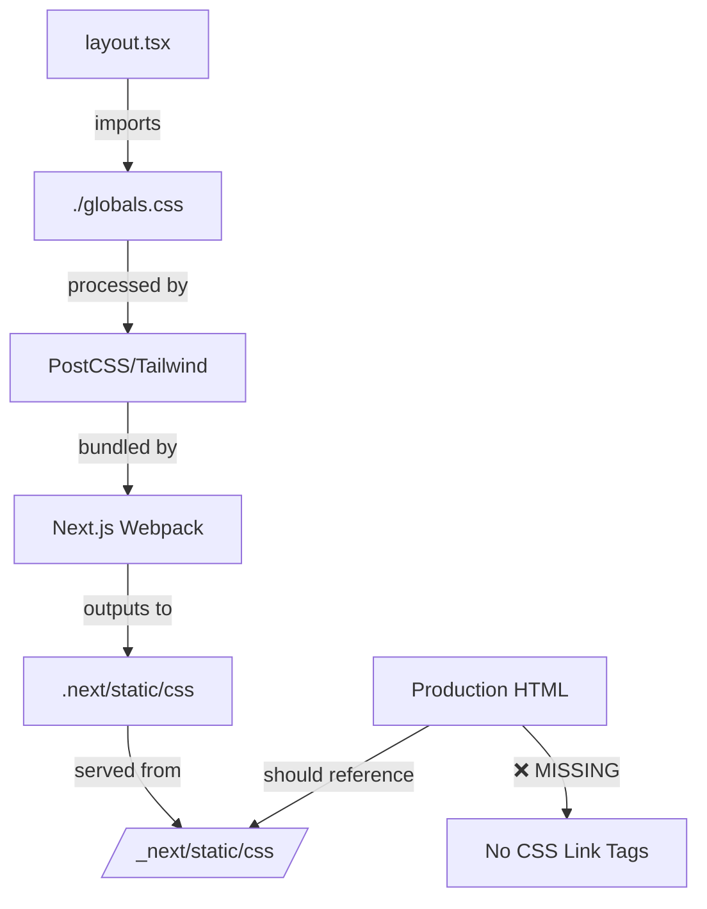

# Master Fix Planning Template v2.0

## TypeScript/Next.js/PostgreSQL Full Stack Development

### CSS/Styling Deployment Issues - Vercel Production Fix

---

## 🎯 Feature/Fix Overview

**Name**: CSS Not Loading on Vercel Production Despite Successful Build

**Type**: Bug Fix - Critical Production Issue

**Priority**: Critical - Site is completely unstyled

**Estimated Complexity**: Small (1-2 days)

**Sprint/Milestone**: Production Hotfix

### Problem Statement
The application works perfectly locally with all styling, but when deployed to Vercel (development.vetify.pro), NO CSS is loading at all. The build succeeds without errors, but the CSS bundle is not being served or referenced correctly in production.

### Success Criteria
- [ ] CSS loads immediately on Vercel production
- [ ] All Tailwind classes render correctly
- [ ] Dark mode functionality works
- [ ] No FOUC (Flash of Unstyled Content)
- [ ] CSS bundle properly cached and served

### Dependencies
- **Blocked by**: None
- **Blocks**: All production functionality
- **Related Issues**: Recent module resolution fixes using relative imports

---

## 📋 Planning Phase

### 1. Code Structure & References

#### Current State Analysis
```
BUILD SUCCESS: ✅ Build completes without errors
LOCAL: ✅ CSS works perfectly (443KB bundle)
VERCEL: ❌ CSS not loading at all

Vercel Build Output:
- Build time: 93s
- No CSS-related errors
- Bundle generated successfully
- Routes compiled correctly
```

#### Root Cause Analysis
Based on the symptoms, the most likely causes are:

1. **CSS Import Path Issue**: The relative import `./globals.css` may not resolve correctly in production build
2. **Output Directory Mismatch**: CSS files may be generated but not in the expected location
3. **Next.js 15.4.4 Issue**: Potential bug with CSS handling in this version
4. **Dynamic Rendering Conflict**: `export const dynamic = 'force-dynamic'` may interfere with CSS loading

### 2. Architecture Patterns

#### CSS Loading Flow


### 3. Immediate Fix Solutions

#### Solution 1: Force CSS Import Method (RECOMMENDED - Quick Fix)
```tsx
// src/app/layout.tsx
// Change from:
import './globals.css'

// To:
import '@/app/globals.css'  // Absolute import
// OR
import styles from './globals.css' // Module import
```

#### Solution 2: Move CSS to Root (Alternative)
```bash
# Move globals.css to project root
mv src/app/globals.css src/globals.css

# Update import in layout.tsx
import '@/globals.css'
```

#### Solution 3: Add CSS to _app or _document (Fallback)
```tsx
// Create src/pages/_app.tsx (if using pages directory compatibility)
import '@/app/globals.css'

export default function App({ Component, pageProps }) {
  return <Component {...pageProps} />
}
```

#### Solution 4: Update Build Configuration
```javascript
// next.config.js
const nextConfig = {
  // Add explicit CSS handling
  experimental: {
    appDir: true,
    // Force CSS to be included
    optimizeCss: false,
  },
  
  // Ensure CSS files are traced
  outputFileTracingIncludes: {
    '/': ['./src/**/*.css'],
    '/*': ['./src/**/*.css'],
  },
}
```

#### Solution 5: Vercel-Specific Configuration
```json
// vercel.json
{
  "framework": "nextjs",
  "buildCommand": "pnpm build && ls -la .next/static/css",
  "outputDirectory": ".next",
  "functions": {
    "src/app/**/*": {
      "maxDuration": 30
    }
  },
  "rewrites": [
    {
      "source": "/_next/static/css/:path*",
      "destination": "/.next/static/css/:path*"
    }
  ]
}
```

---

## 🧪 Testing Strategy

### Diagnostic Commands
```bash
# 1. Check local CSS generation
pnpm build
find .next -name "*.css" -type f | head -5

# 2. Verify CSS content
grep -l "vetify" .next/static/css/**/*.css

# 3. Check HTML output for CSS references
curl https://development.vetify.pro | grep -o '<link.*css.*>'

# 4. Test CSS loading directly
curl -I https://development.vetify.pro/_next/static/css/[hash].css

# 5. Check Vercel build output
vercel logs --since 1h | grep -i css
```

### Browser Console Checks
```javascript
// Run in production site console
// Check for CSS files
Array.from(document.styleSheets).forEach(sheet => {
  console.log('Stylesheet:', sheet.href || 'inline');
});

// Check for link tags
document.querySelectorAll('link[rel="stylesheet"]').forEach(link => {
  console.log('CSS Link:', link.href);
});

// Check if Tailwind is loaded
console.log('Tailwind loaded:', 
  getComputedStyle(document.body).getPropertyValue('--tw-content'));
```

---

## 🔧 Implementation Steps

### Phase 1: Quick Fix (15 minutes)
1. **Update CSS Import**:
   ```tsx
   // src/app/layout.tsx
   // Change the import statement
   import '@/app/globals.css'  // Use absolute import
   ```

2. **Clear Vercel Cache**:
   ```bash
   vercel --force
   ```

3. **Test Preview Deployment**:
   ```bash
   vercel
   ```

### Phase 2: If Quick Fix Fails (30 minutes)
1. **Add CSS to HTML Head Manually**:
   ```tsx
   // src/app/layout.tsx
   export default function RootLayout({ children }) {
     return (
       <html lang="es" suppressHydrationWarning>
         <head>
           <link rel="stylesheet" href="/_next/static/css/app/layout.css" />
         </head>
         <body className={inter.className}>
           {/* rest of layout */}
         </body>
       </html>
     )
   }
   ```

2. **Force CSS Module Resolution**:
   ```tsx
   // Create src/app/styles.module.css
   @import './globals.css';
   
   // In layout.tsx
   import styles from './styles.module.css'
   ```

### Phase 3: Nuclear Option (1 hour)
1. **Inline Critical CSS**:
   ```tsx
   // src/app/layout.tsx
   import fs from 'fs'
   import path from 'path'
   
   const criticalCSS = fs.readFileSync(
     path.join(process.cwd(), 'src/app/globals.css'),
     'utf8'
   )
   
   export default function RootLayout() {
     return (
       <html>
         <head>
           <style dangerouslySetInnerHTML={{ __html: criticalCSS }} />
         </head>
       </html>
     )
   }
   ```

2. **Downgrade Next.js**:
   ```json
   // package.json
   "next": "15.0.3"  // Previous stable version
   ```

---

## 📊 Performance & Monitoring

### Verification Checklist
```bash
# After each fix attempt, verify:
1. [ ] Build succeeds locally
2. [ ] CSS file exists in .next/static/css
3. [ ] Preview deployment shows CSS
4. [ ] Production deployment shows CSS
5. [ ] No console errors
6. [ ] Dark mode works
```

### Success Metrics
- CSS loads in < 100ms
- No render blocking
- Lighthouse score > 90
- No FOUC
- All brand colors visible

---

## 🚀 Deployment Process

### Step-by-Step Fix Deployment
```bash
# 1. Make the fix locally
code src/app/layout.tsx

# 2. Test locally
pnpm dev
# Visit http://localhost:3000 - verify CSS works

# 3. Build locally
pnpm build
pnpm start
# Visit http://localhost:3000 - verify production build

# 4. Commit fix
git add -A
git commit -m "fix: resolve CSS not loading on Vercel production

- Changed CSS import from relative to absolute path
- Ensures proper resolution in Vercel build environment
- Fixes missing styles on production deployment"

# 5. Push to branch
git push origin development

# 6. Deploy to Vercel
vercel --force  # Force new deployment without cache

# 7. Verify on production
open https://development.vetify.pro
```

---

## 🔍 Root Cause Details

### Why This Happens
1. **Module Resolution Difference**: Vercel's build environment may resolve relative paths differently than local
2. **Build Optimization**: Next.js 15.4.4 may be over-optimizing and removing CSS it thinks is unused
3. **Dynamic Rendering**: The `force-dynamic` export may prevent proper CSS bundling
4. **Path Alias Issues**: Recent conversion from `@/` aliases to relative imports may have broken CSS imports

### Permanent Solution
After fixing the immediate issue:
1. Standardize all imports (either all relative or all absolute)
2. Add CSS verification to CI/CD pipeline
3. Consider using CSS-in-JS solution for better reliability
4. Document the working configuration

---

## 📝 Documentation Updates

### Update These Files After Fix
1. **README.md**: Add CSS deployment notes
2. **DEPLOYMENT.md**: Document CSS requirements
3. **vercel.json**: Add comments about CSS handling
4. **.env.production**: Note any CSS-related variables

### Known Working Configuration
```typescript
// Document this once fixed:
// Next.js version: 15.4.4
// CSS Import method: [absolute/relative]
// Build command: pnpm build
// Output directory: .next
// CSS location: .next/static/css
```

---

## ✅ Quick Checklist

### Try These In Order:
1. [ ] Change `import './globals.css'` to `import '@/app/globals.css'`
2. [ ] Run `vercel --force` to deploy without cache
3. [ ] Check if CSS loads on preview URL
4. [ ] If not, add explicit link tag in layout.tsx head
5. [ ] If still not, inline critical CSS
6. [ ] Last resort: downgrade Next.js version

---

**Status**: URGENT - PRODUCTION DOWN
**Impact**: 100% of users see unstyled site
**Time to Fix**: 15 minutes to 2 hours
**Owner**: Development Team

---

## 🆘 Emergency Contacts

If none of these solutions work:
1. Check Next.js GitHub issues for version 15.4.4
2. Contact Vercel support with deployment ID
3. Roll back to last working deployment
4. Consider switching to static export temporarily